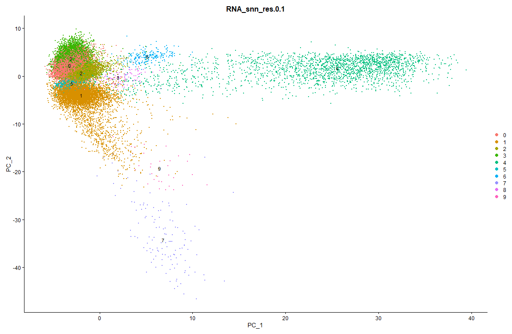

# Single Cell RNAseq Gene Expression Analysis Tutorial
Author: Jesus Zeno

# Overview:
The purpose of this tutorial is to help users familiarize themselves with processing single cell RNAseq data with Seurat. This workflow will start from the barcodes, genes, and matrix files and end with visualization of the clusters.


## Table of Contents

<a href="#Documentation">Documentation</a></br>

<a href="#Setup">Setup</a></br>
<a href="#QC">QC</a></br>
<a href="#Filtering Unwanted Cells">Filtering Unwanted Cells</a></br>
<a href="#Normalize Data">Normalize Data</a></br>
<a href="#Identify Highly Variable Features">Identify Highly Variable Features</a></br>
<a href="#Scaling">Scaling</a></br>
<a href="#Perform Linear Dimensionality Reduction">Perform Linear Dimensionality Reduction</a></br>
<a href="#Clustering">Clustering</a></br>
</br>

## <a name="Documentation">Documentation</a>
Seurat: https://satijalab.org/seurat/articles/pbmc3k_tutorial.html#setup-the-seurat-object-1

[Video Reference](https://youtu.be/5HBzgsz8qyk) for how this was done using a different dataset


### <a name="Setup">Setup</a>
```{R eval=FALSE}
# Script to perform standard workflow steps to analyze single cell RNA-Seq data
# Data: 40k Mixture of NSCLC DTCs from 7 donors, 3' HT v3.1
# Data source: https://www.10xgenomics.com/resources/datasets/40-k-mixture-of-nsclc-dt-cs-from-7-donors-3-ht-v-3-1-3-1-high-6-1-0
# File: HDF5 raw file. 

# Make sure to set your working directory appropriately
# setwd("~/Your/File/Path/single_cell_RNASeq/scripts")


# Install libraries that aren't already installed.
install.packages("hdf5r")
install.packages("Seurat")
install.packages("patchwork")

# Load libraries
library(Seurat)
library(tidyverse)
library(hdf5r)

# Load the NSCLC dataset
nsclc.sparse.m <- Read10X_h5(filename = 'C:\\Your\\File\\Path\\40k_NSCLC_DTC_3p_HT_nextgem_Multiplex_count_raw_feature_bc_matrix.h5')

# Look at multiple modalities present. 
str(nsclc.sparse.m)
# List of 3
# $ Gene Expression
# $ Antibody Capture
# $ Multiplexing Capture
# We are only worried about the gene expression modality.

# This will give us the counts of the gene expression.
cts <-  nsclc.sparse.m$`Gene Expression`
cts[1:10, 1:10] # View first 10 rows and columns of sparse matrix


# Initialize the Seurat object with the raw (non-normalized data):
# Read counts into Seurat object.
# Use cts variable as the counts. Name the project non-small cell lung cancer 
# (NSCLC). Keep all features in at least 3 cells and that have at least 200 
# genes. 
nsclc.seurat.obj <- CreateSeuratObject(counts = cts, project = "NSCLC", min.cells = 3, min.features = 200)

# Look at seurat object
str(nsclc.seurat.obj)
nsclc.seurat.obj
# 31117 features across 58986 samples within 1 assay 
# Active assay: RNA (31117 features, 0 variable features)
```


### <a name="QC">QC</a>
```{R eval=FALSE}
# Get an idea of what the metadata looks like
View(nsclc.seurat.obj@meta.data)

# Look at total number of features (genes), number of total molecules 
# (nCount RNA) in a cell to give us an idea if the cell is poor quality.
# Poor quality cells would have low number of genes or molecules detected.
# It's possible to have high number of genes or molecules detected because of 
# doublets or multiple cells sequenced together that are labeled as a single 
# cell. Look at mitochondrial gene percentage because in low quality or dying 
# cells we see a higher number of mitochondrial genes. 

# Assign % MT reads to a column in the metadata. 
nsclc.seurat.obj[["percent.mt"]] <- PercentageFeatureSet(nsclc.seurat.obj, pattern = "^MT-")
View(nsclc.seurat.obj@meta.data) # sanity check

# Visualize the features and save file
png("QC_metrics_as_Violin_plot.png", width = 1150, height = 750)
VlnPlot(nsclc.seurat.obj, features = c("nFeature_RNA", "nCount_RNA", 
                                       "percent.mt"), ncol = 3)
dev.off()
# Based on plots, we can see that there is a large amount of cells that have a 
# different number of genes spread across a spectrum. We also have a lot of 
# cells with a higher number of molecules detected as well as a high percentage # of mitochondrial DNA. We want to filter out these cells for downstream 
# processing.
```

```{R eval=FALSE}
# Let's look at another metric so we can have a second point of reference to 
# determine what to filter. Good quality cells should have a good number of 
# genes and molecules detected. 
png("QC_metrics_as_Feature_Scatter_plot.png", width = 1150, height = 750)
FeatureScatter(nsclc.seurat.obj, feature1 = "nCount_RNA", 
               feature2 = "nFeature_RNA") + geom_smooth(method = 'lm')
dev.off()
# A majority of cells seem to follow the straight line which is good. We don't 
# want to see any cells in the lower right corner, which would indicate that 
# the experiment has only captured a few genes and those genes are being 
# transcribed repeatedly. We also don't want to see any cells in the top left 
# corner, which would indicate the experiment captured a high number of genes
# but they aren't deeply sequenced enough. 
```


### <a name="Filtering Unwanted Cells">Filtering Unwanted Cells</a>
```{R eval=FALSE}
nsclc.seurat.obj <- subset(nsclc.seurat.obj, subset = nFeature_RNA > 200 
                           & nFeature_RNA < 2500 & percent.mt < 5)
# 31117 features across 24859 samples within 1 assay 
# Active assay: RNA (31117 features, 0 variable features)
# We eliminated about 25k samples from filtering. 
```


### <a name="Normalize Data">Normalize Data</a>
```{R eval=FALSE}
# Divide the gene expression measurements by each expression. Then multiply 
# it by a scaling factor. Then log transform it. This will get expression 
# measurements in relative measures so we can make comparisions across
# different cells. 

# Values listed below are the default values. If we need to make changes, we
# can specify them, but it's not necessary right now. Run simpler version.
# nsclc.seurat.obj <- NormalizeData(nsclc.seurat.obj, normalization.method = "LogNormalize", scale.factor = 10000)

# Simple version:
nsclc.seurat.obj <- NormalizeData(nsclc.seurat.obj)

# With this line, we can see all the "@ commands" that we have run on our 
# Seurat object. 
str(nsclc.seurat.obj)
```


### <a name="Identify Highly Variable Features">Identify Highly Variable Features</a>
```{R eval=FALSE}
# We only want to select a subset of features (genes) that exhibit a high 
# cell to cell variation. Focusing on only these genes highlights the
# biological signal in your scRNAseq data sets. 
nsclc.seurat.obj <- FindVariableFeatures(nsclc.seurat.obj, 
                                         selection.method = "vst", 
                                         nfeatures = 2000)

# Identify the 10 most highly variable genes
top10 <- head(VariableFeatures(nsclc.seurat.obj), 10)
# "IGHA1"  "IGKC"   "IGLC2"  "IGHG1"  "IGHM"   "IGHG3"  "JCHAIN" "IGLC3" 
# "TPSB2"  "IGHGP" 

# Plot variable features with and without labels
plot1 <- VariableFeaturePlot(nsclc.seurat.obj)
plot2 <- LabelPoints(plot = plot1, points = top10, repel = TRUE)
# Save variable features with labels. If we want both plots side by side, then
# do the following: plot1 + plot2
png("Top_10_Variable_Features.png", width = 750, height = 750)
plot2
dev.off()
```


### <a name="Scaling">Scaling</a>
```{R eval=FALSE}
# There are many unwanted sources of variation due to technical noise 
# (batch effects) or biological sources (cell cycle differences between cells).
# Scaling the data regresses out sources of variation. 
all.genes <- rownames(nsclc.seurat.obj)
nsclc.seurat.obj <- ScaleData(nsclc.seurat.obj, features = all.genes)
# Troubleshooting tip: if you get an error of the following:
# Error: cannot allocate vector of size
# You can clear out unneeded objects using the rm() function.
# You can clean out address space using the gc() function.
# You can increase memory limit in R using memory.limit(size = 17000) where 
# the size is in Megabytes. So 17000 would be 17Gb of memory. 

str(nsclc.seurat.obj)
# There is an @assays slot. In the @ counts slot we can see the counts from 
# the count matrix that we saw in the first step. @Data slot has log normalized
# counts. @Scale.data has all the scaled data. 
```

### <a name="Perform Linear Dimensionality Reduction">Perform Linear Dimensionality Reduction</a>
```{R eval=FALSE}
# Principal component analysis to identify sources of heterogeneity of data set.
nsclc.seurat.obj <- RunPCA(nsclc.seurat.obj, 
                           features = VariableFeatures(object = nsclc.seurat.obj))

# Full list of PCs for positive and negative:
# PC_ 1 
# Positive:  AIF1, CD68, TYROBP, C5AR1, FCER1G, PLAUR, OLR1, IFI30, CD14, FCGR2A 
# CST3, S100A9, AC020656.1, NCF2, S100A8, LYZ, C15orf48, TREM1, PLXDC2, VCAN 
# THBD, MS4A6A, SERPINA1, LST1, CTSB, SMIM25, IGSF6, CTSS, ETS2, FCN1 
# Negative:  CD69, IL32, LTB, TRBC1, CCL5, CD7, ITM2A, KLRB1, IL7R, GZMA 
# BIRC3, ICOS, TIGIT, CD27, BATF, IFNG, GZMK, TNFRSF18, IGKC, KLRK1 
# CCR7, GPR171, TNFRSF4, CTSW, CD8A, LINC01871, GZMH, NKG7, FKBP11, CTLA4

# PC_ 2 
# Positive:  CD69, S100A4, CCL5, IL32, CD7, CLEC2B, ZNF331, RGCC, IL7R, CST7 
# RGS1, DUSP4, NKG7, BIRC3, TRBC1, LTB, GZMA, GZMB, TXNIP, ITM2A 
# NR4A2, CTSW, GPR65, KLRD1, IFNG, KLRB1, ID2, KLRK1, VIM, TIGIT 
# Negative:  CALD1, BGN, C1R, SPARCL1, MGP, NNMT, CCN1, RND3, DCN, IGFBP7 
# TCIM, C1S, C11orf96, NUPR1, KRT19, FTL, RARRES2, ELF3, SERPING1, TAGLN 
# KRT18, ADIRF, TPM1, CCDC80, KRT8, MYL9, CTTN, TPM2, COL1A2, CCN2 

# PC_ 3 
# Positive:  MS4A1, BANK1, CD79A, HLA-DRA, HLA-DQA1, VPREB3, MEF2C, HLA-DQB1, CD74, SMIM14 
# HLA-DRB1, IRF8, CD83, HLA-DPB1, HLA-DPA1, LINC01857, CD40, IGKC, LY9, MARCKS 
# LINC01781, SPIB, BASP1, COBLL1, FCRL5, GRASP, PHACTR1, IGHM, HLA-DMA, TCF4 
# Negative:  IL32, CCL5, CD7, NKG7, CST7, IL7R, GZMA, CLEC2B, TRBC1, S100A4 
# ID2, ANXA1, RGCC, KLRD1, CTSW, KLRK1, IFNG, MT2A, KLRB1, GZMH 
# LINC01871, CD8A, ITM2A, CYTOR, GNLY, PHLDA1, TNFRSF18, MAF, DUSP4, GZMB 

# PC_ 4 
# Positive:  FTL, SPP1, LYZ, KRT19, S100A9, CXCL8, KRT8, APOE, APOC1, KRT18 
# S100A8, FTH1, S100A11, SLC11A1, WFDC2, MIR205HG, CLDN4, ELF3, MGST1, SERPINA1 
# OLR1, C15orf48, EPCAM, SCGB1A1, SMIM25, SFTPB, CCL18, FXYD3, AGR2, MARCO 
# Negative:  TCF4, MEF2C, HERPUD1, BGN, SPARCL1, CD69, MS4A1, IRF8, C1R, GRASP 
# CD83, CD79A, BANK1, NNMT, SERPINF1, HLA-DQA1, IRF4, PPP1R14A, LY9, LTB 
# SPIB, AEBP1, KLF2, SOD3, GADD45B, PLAC9, EMILIN1, IGFBP7, LILRA4, MXRA8 

# PC_ 5 
# Positive:  TNFRSF4, BATF, MAF, CTLA4, LTB, ICOS, ICA1, MAGEH1, IL7R, TBC1D4 
# TSHZ2, MAL, CXCL13, GK, FOXP3, TNFRSF18, TIGIT, CHN1, BIRC3, PASK 
# IL2RA, RTKN2, LINC01943, BGN, CD200, IGFL2, CCR7, CD27, JMY, LIMS1 
# Negative:  GZMB, NKG7, KLRD1, CLIC3, LILRA4, CCL5, SCT, LRRC26, KLRK1, GNLY 
# CTSW, GZMH, EGLN3, PTCRA, SMPD3, JCHAIN, GZMA, CCL4, DERL3, PLD4 
# CLEC4C, MZB1, AKR1C1, CD8A, XCL2, IL3RA, SLAMF7, AKR1C2, ITM2C, C12orf75

# visualize PCA results.
# Look at top five features. dims = is the principal components that we want 
# to look at. 
print(nsclc.seurat.obj[["pca"]], dims = 1:5, nfeatures = 5)
# PC_ 1 
# Positive:  AIF1, CD68, TYROBP, C5AR1, FCER1G 
# Negative:  CD69, IL32, LTB, TRBC1, CCL5 
# PC_ 2 
# Positive:  CD69, S100A4, CCL5, IL32, CD7 
# Negative:  CALD1, BGN, C1R, SPARCL1, MGP 
# PC_ 3 
# Positive:  MS4A1, BANK1, CD79A, HLA-DRA, HLA-DQA1 
# Negative:  IL32, CCL5, CD7, NKG7, CST7 
# PC_ 4 
# Positive:  FTL, SPP1, LYZ, KRT19, S100A9 
# Negative:  TCF4, MEF2C, HERPUD1, BGN, SPARCL1 
# PC_ 5 
# Positive:  TNFRSF4, BATF, MAF, CTLA4, LTB 
# Negative:  GZMB, NKG7, KLRD1, CLIC3, LILRA4 

# Identify which PCs we should include in our downstream analysis by looking at
# the PC scores and the genes that contribute to that PC. 
# We are plotting for only one PC now (dims=). We can plot multiple heatmaps 
# at once by setting dims=1:n where n is the number of PCs we are looking at.
png("PCA_results_Heat_Map.png", width = 1150, height = 750)
DimHeatmap(nsclc.seurat.obj, dims = 1, cells = 500, balanced = TRUE)
dev.off()
```


```{R eval=FALSE}
# Determine dimensionality of the data:
# Choosing only those statistically significant PCs which capture a majority 
# of the signal in our downstream analysis. 
png("PCA_results_Elbow_Plot.png", width = 1150, height = 750)
ElbowPlot(nsclc.seurat.obj)
dev.off()
# Based on the plot 18 is the cutoff, but to be safe we will go with 20. 
```


### <a name="Clustering">Clustering</a>
```{R eval=FALSE}
# Identify the neighbors first. Since we determined we will go with 20 for the 
# cutoff, dims = 1:20. dims = 1:x where x is what we decided the cutoff was for
# the statistically significant components. 
nsclc.seurat.obj <- FindNeighbors(nsclc.seurat.obj, dims = 1:20)

# Understanding resolution. Resolution parameter: lower the number = fewer 
# clusters. Higher number = more clusters. 
nsclc.seurat.obj <- FindClusters(nsclc.seurat.obj, resolution = c(0.1,0.3, 0.5, 0.7, 1))
View(nsclc.seurat.obj@meta.data)

# Visualize clusters with different resolutions. Generally start with lower 
# resolutions and then work your way up to see which resolution is best for your
# data. 
png("Clustering_resolution_0.1.png", width = 1150, height = 750)
DimPlot(nsclc.seurat.obj, group.by = "RNA_snn_res.0.1", label = TRUE)
dev.off()
# Clusters are distinct at .1 resolution. 
```



```{R eval=FALSE}
png("Clustering_resolution_0.3.png", width = 1150, height = 750)
DimPlot(nsclc.seurat.obj, group.by = "RNA_snn_res.0.3", label = TRUE)
dev.off()
# Clusters are overlapping and not distinct at resolution of .3
```


```{R eval=FALSE}
png("Clustering_resolution_0.5.png", width = 1150, height = 750)
DimPlot(nsclc.seurat.obj, group.by = "RNA_snn_res.0.5", label = TRUE)
dev.off()
# Clusters are overlapping and not distinct at resolution of .5
```


```{R eval=FALSE}
# Setting identity of clusters:
# Check the identity of the clusters before changing. It defaulted to the 
# resolution with 23 clusters.
Idents(nsclc.seurat.obj) 

# Change identity (clustering) of cells
Idents(nsclc.seurat.obj) <- "RNA_snn_res.0.1" 

# Sanity check. Now only 10 clusters. 
Idents(nsclc.seurat.obj)

# Non-linear dimensionality reduction --------------
# Viewing clusters in low dimension space. Goal is to group cells of similar 
# type together so we can further explore and visualize data. 

# If you haven't installed UMAP, you can do so via 
# reticulate::py_install(packages ='umap-learn')
nsclc.seurat.obj <- RunUMAP(nsclc.seurat.obj, dims = 1:20)
# note that you can set `label = TRUE` or use the LabelClusters function to help label
# individual clusters
png("UMAP_Plots.png", width = 1150, height = 750)
DimPlot(nsclc.seurat.obj, reduction = "umap", label = TRUE)
dev.off()
```


```{R eval=FALSE}
# Save as an RDS object so we don't have to do all the steps again and we can 
# easily call this again later if needed.
saveRDS(nsclc.seurat.obj, file = 'C:\\Your\\File\\Path\\40k_NSCLC_DTC_3p_HT_nextgem_Multiplex_count_raw_feature_bc_matrix.rds')

# If we need to read the rds file back in to pick up where we left off, use this
nsclc.seurat.obj <- readRDS(file = 'C:\\Your\\File\\Path\\40k_NSCLC_DTC_3p_HT_nextgem_Multiplex_count_raw_feature_bc_matrix.rds')
```